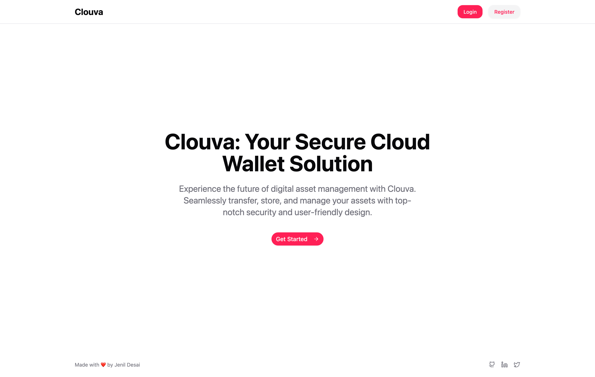
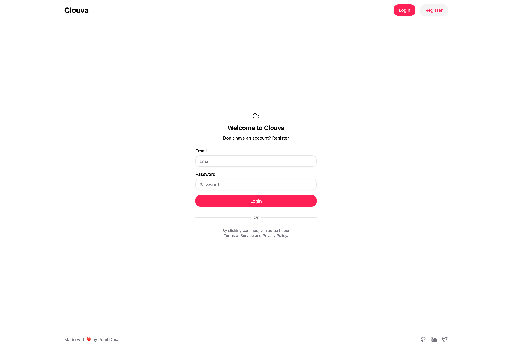
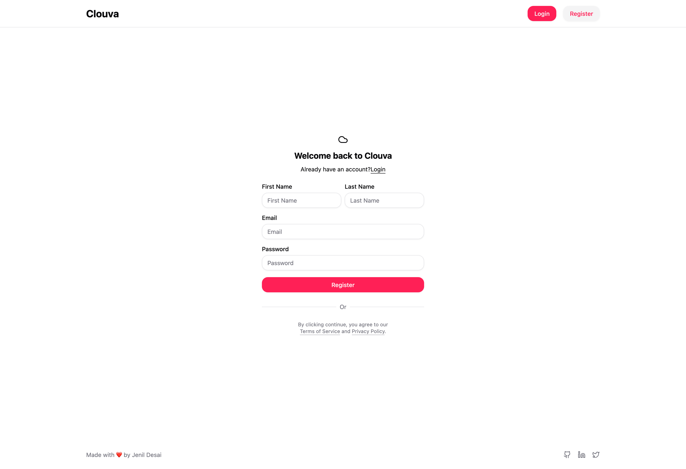
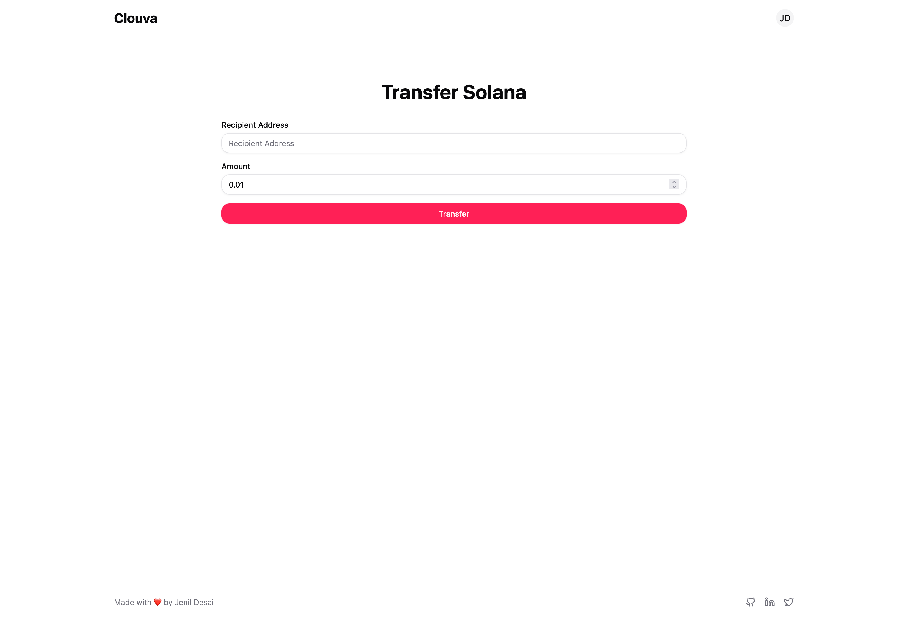

# 🔒☁️ Clouva – Lightweight Solana Wallet in the Cloud

Clouva is a fast, secure, and user-friendly Solana wallet that lives in the cloud. Designed to simplify the onboarding experience for Web3 users, it offers quick registration, seamless Solana transfers, and secure private key storage — all in a minimal yet modern UI powered by Next.js and Tailwind CSS.

---

## 📑 Table of Contents

1. [Overview](#-overview)
2. [Tech Stack](#-tech-stack)
3. [Packages & Libraries](#-packages--libraries)
4. [Getting Started](#-getting-started)
5. [Setup](#-setup)
6. [Features](#-features)
7. [Demo & Screenshots](#-demo--screenshots)
8. [Acknowledgments](#-acknowledgments)
9. [License](#-license)

---

## 🌟 Overview

Clouva is your cloud-native companion for managing Solana assets. Built for speed and simplicity, it handles user authentication, secure wallet generation, and effortless token transfers — all while maintaining full control over your private keys and keeping user experience front and center.

---

## 🧠 Tech Stack

| Layer        | Tech                              |
|--------------|-----------------------------------|
| Framework    | Next.js (TypeScript)              |
| Styling      | Tailwind CSS                      |
| Backend      | Bun.js + Prisma ORM               |
| Database     | PostgreSQL                        |
| Blockchain   | Solana                            |

---

## 📦 Packages & Libraries

- `@solana/web3.js` – Solana blockchain interaction
- `bcrypt` – Password hashing
- `jsonwebtoken` / `jwt-decode` – Token-based authentication
- `react-hook-form` – Form handling
- `zod` – Schema validation
- `sonner` – Toast notifications
- `@hookform/resolvers` – Hookform + Zod integration

---

## 🚀 Getting Started

> Prerequisites:
- Bun.js (or Node.js)
- PostgreSQL
- Git
- IDE (WebStorm / VS Code / Zed)

---

## ⚙️ Setup

1. Clone the repository:
   ```bash
   git clone https://github.com/Jenil-Desai/Clouva.git
   ```

2. Navigate to the project directory:

   ```bash
   cd clouva
   ```

3. Install dependencies:

   ```bash
   bun install   # or use npm/yarn
   ```

4. Set up your `.env` file (DB, JWT, etc.)

5. Start the development server:

   ```bash
   bun dev
   ```

---

## 🎯 Features

* 🔐 **User Authentication**

  * Secure login and registration with JWT and bcrypt

* 🧾 **Auto Wallet Generation**

  * Public/private keypair is securely generated and linked to the user account

* 💸 **Transfer Solana**

  * Send SOL to any valid Solana address with instant feedback

---

## 📸 Demo & Screenshots

- [Live Demo](https://clouva.vercel.app)

| Screenshot                              | Description         |
|------------------------------------------|---------------------|
|    | Landing Page        |
|        | Login Page          |
|  | Register Page       |
|  | Transfer Page       |

---

## 🙏 Acknowledgments

1. **Harkirat Singh** – Web3 Cohort-3 Assignment
2. [Shadcn UI](https://ui.shadcn.com)
3. [Next.js Docs](https://nextjs.org/docs)
4. [JWT Decode Docs](https://www.npmjs.com/package/jwt-decode)

---

## 📜 License

This project is licensed under the **MIT License**.

---

> Clouva – Your Solana wallet, now on the cloud.
